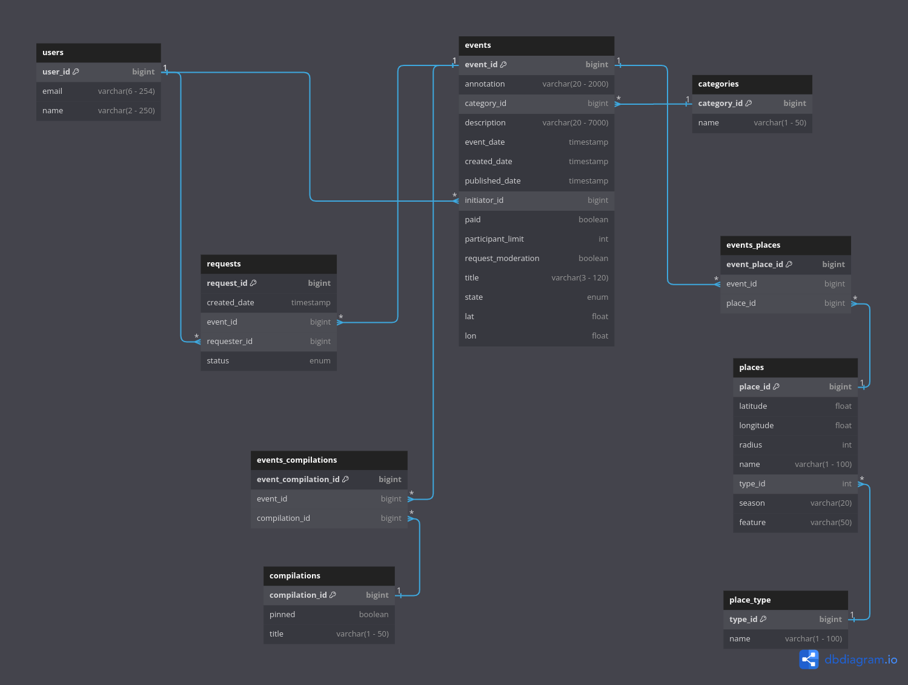
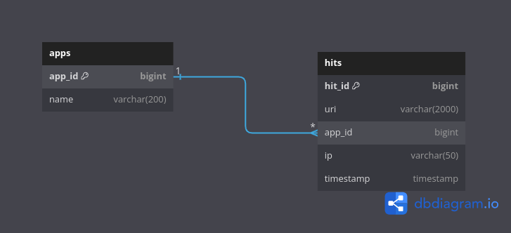

# ExploreWithMe :dizzy:

В приложении пользователи смогут делиться информацией об интересных событиях и находить компанию для участия в них.

## Основной сервис :eyes:

**ER-диаграмма**

`users` - данные о пользователях:

_user_id_ - первичный ключ, идентификатор записи;

_email_ - почтовый адрес;

_name_ - имя.

`events` - данные о событиях:

_event_id_ - первичный ключ, идентификатор записи;

_annotation_ - краткое описание;

_category_id_ - id категории, к которой относится событие;

_description_ - полное описание события;

_event_date_ - дата и время, на которые намечено событие (не может быть раньше, чем через два часа от текущего момента);

_created_date_ - дата и время создания события;

_published_date_ - дата и время публикации события;

_initiator_id_ - id пользователя - создателя события;

_location_id_ - id места проведения события;

_paid (default: false)_ - нужно ли оплачивать участие в событии;

_participant_limit (default: 0)_ - ограничение на количество участников. Ноль означает отсутствие ограничения;

_request_moderation (default: true)_ - нужна ли премодерация заявок на участие. _true_ - все заявки будут ожидать подтверждения инициатором события, _false_ - будут подтверждаться автоматически;

_title_ - заголовок события;

_state_ - список состояний жизненного цикла события: PENDING, PUBLISHED, CANCELED.

`categories` - каждое событие должно относиться к какой-то из закреплённых в приложении категорий;

`locations` - широта и долгота места проведения события;

`requests` - заявки на участие в событии:

`compilations` - подборки событий:

`events_compilations` - вспомогательная таблица для связи событий и подборок. Многие - ко многим: событие может быть в нескольких подборках, в подборке - несколько событий.

API основного сервиса разделён на три части:

- **публичная** - доступна без регистрации любому пользователю сети;
- **закрытая** - доступна только авторизованным пользователям;
- **административная** - для администраторов сервиса.

|                    Любой пользователь                     |                                Авторизованные пользователи                                 |                                Администраторы сервиса                                 |
|:---------------------------------------------------------:|:------------------------------------------------------------------------------------------:|:-------------------------------------------------------------------------------------:|
|                 Просмотр подборок событий                 | Добавление новых событий, их редактирование и получение полной информации о своих событиях |           Создание и удаление пользователей, получение информации о них               |
|      Получение информации о существующих категориях       | Создание и отмена заявок на участие в чужих событиях, получение информации о своих заявках | Получение информации о событиях по заданным фильтрам, отклонение и публикация событий |
| Получение информации о событиях с возможностью фильтрации |   Получение информации о запросах на участие в своём событии, их подтверждение и отмена    |                            Добавление и удаление категорий                            |
|                                                           |                                                                                            |                   Создание, обновление и удаление подборок событий                    |

## Сервис статистики :bar_chart:

Хранит количество просмотров и позволяет делать различные выборки для анализа работы приложения.

**ER-диаграмма**

`apps` - данные о сервисах, для которых собирается статистика:

_app_id_ - первичный ключ, идентификатор записи;

_name_ — название сервиса.

`hits` - данные о просмотрах:

_hit_id_ - первичный ключ, идентификатор записи;

_uri_ - URI, для которого был осуществлен запрос;

_app_id_ — идентификатор сервиса, для которого записывается информация;

_ip_ — IP-адрес пользователя, осуществившего запрос;

_timestamp_ — дата и время, когда был совершен запрос к эндпоинту.

https://dbdiagram.io/d/6527c997ffbf5169f08e5a86